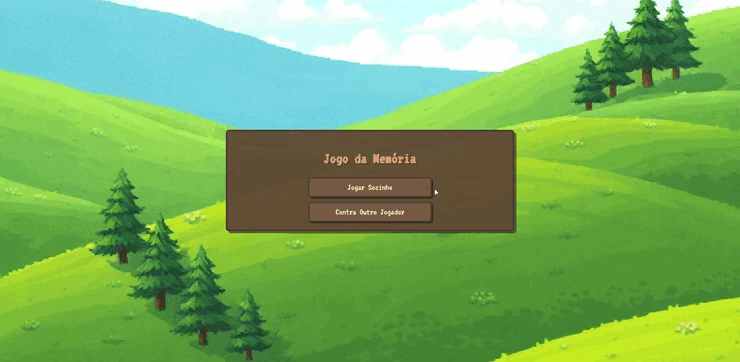

# 🌱🍓 Jogo da Memória 

Um jogo da memória encantador, inspirado no estilo aconchegante de **Stardew Valley**, onde os cartões são pequenas mudas que escondem frutas deliciosas. Vire, combine e pontue!

## 🔗 Acesse o jogo

👉 [Jogar agora!](https://avrilstihler.github.io/Jogo_da_Memoria/)

## 🎮 Funcionalidades

* 👤 **Modo Solo:** jogue sozinho e desafie sua própria memória.
* 👥 **Modo 2 Jogadores:** sistema de turnos para competir com outra pessoa no mesmo dispositivo.
* 🎨 **Estilo em Pixel Art:** inspirado em jogos como Stardew Valley, com cards representando plantas e frutas.
* 🔊 **Efeitos sonoros e música de fundo:** interações agradáveis e ambiente imersivo.
* 🏆 **Sistema de pontuação:** contabiliza acertos de cada jogador no modo competitivo ou sua performance no modo solo.
* 🌿 **Interface simples, bonita e aconchegante.**

## 🛠️ Tecnologias 
  

## 📜 Licença

Este projeto é de código aberto e está licenciado sob a [MIT License](LICENSE).

